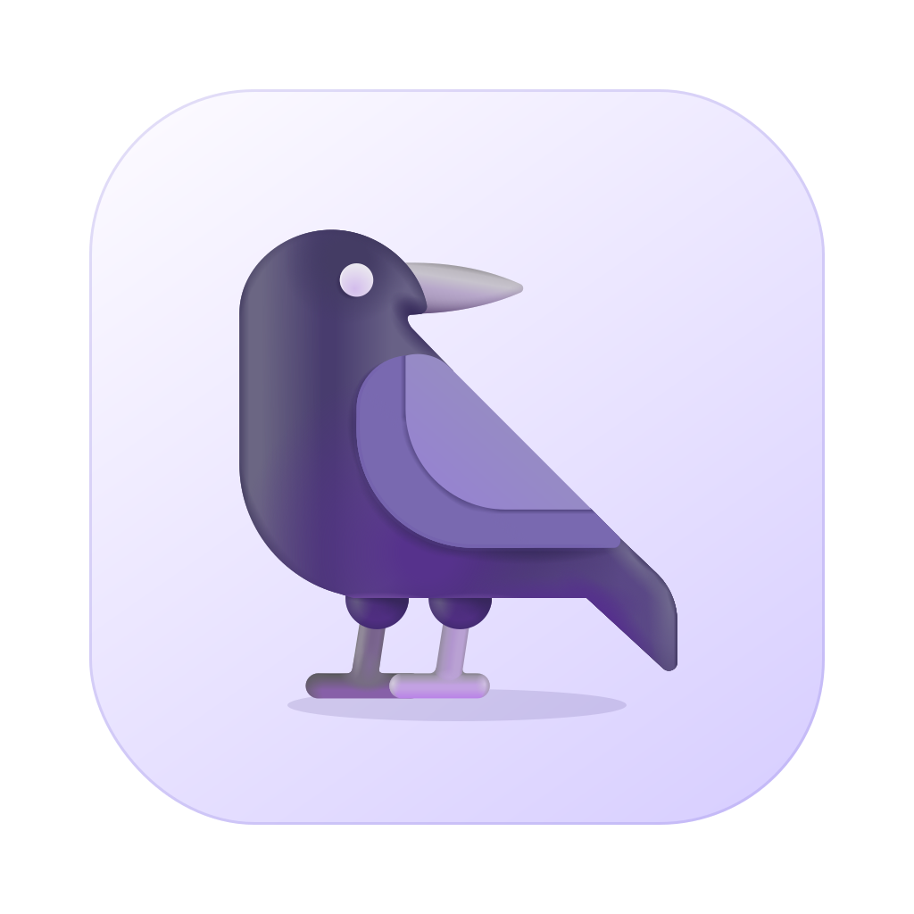
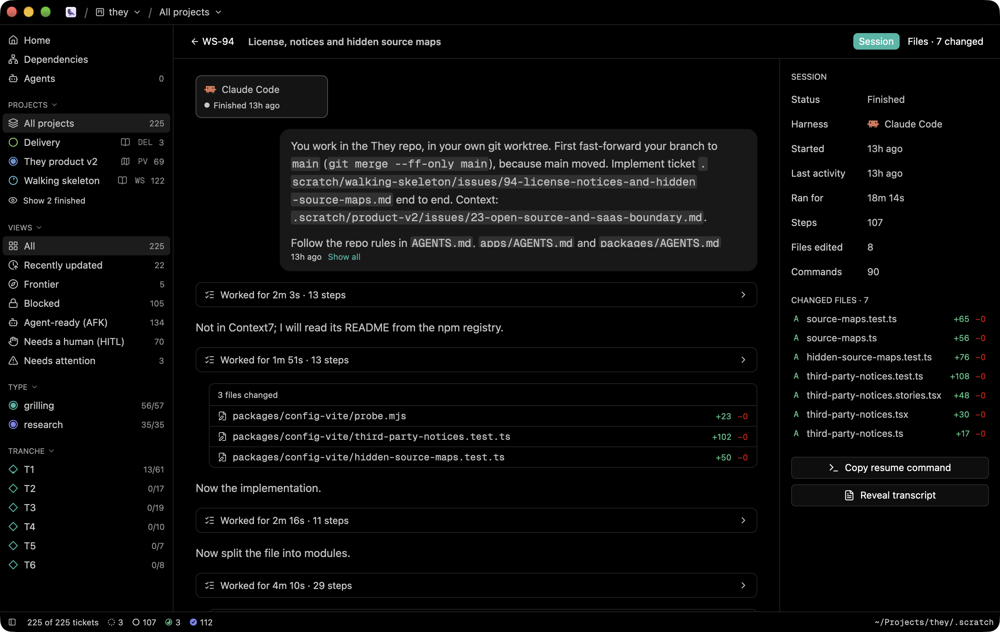

<div align="center">



# Kuzgun

**A raven's-eye view of your agents' work.**

A native macOS kanban board for [mattpocock/skills](https://github.com/mattpocock/skills)
tickets. It's written in Rust on [GPUI](https://github.com/zed-industries/zed), the
GPU-accelerated UI framework behind the Zed editor.

[](LICENSE)




</div>

A native macOS kanban board for [mattpocock/skills](https://github.com/mattpocock/skills)
tickets. Kuzgun reads the local issue tracker the skills write under
`.scratch/` (`/to-tickets`, `/triage`, `/wayfinder`), and follows the files live. It shares its look with [Tusk](https://github.com/alpcanaydin/tusk).

Kuzgun only reads. The ticket files belong to the agents and skills that
write them (`/to-tickets`, `/triage`, `/wayfinder`, `/implement`). To act
on a ticket, copy its slash command or open it in your editor.

## What it shows

- **Welcome screen**: open a folder (`cmd-o`), or drop one on the window.
  Opened folders are saved; `cmd-1…5` reopens them. Right-click a saved
  board to pin it, reveal it or remove it.
- **Board**: one column per status, in workflow order (`needs-triage`,
  `needs-info`, `draft`, `open`, `ready-for-agent`, `ready-for-human`,
  `claimed`, `in-progress`, `in-review`, `done`, `resolved`, `wontfix`).
  Each column has a Linear-style state icon. Columns collapse. Card lists
  are virtualized.
- **Cards**: ticket key, title, AFK / HITL badge, frontier mark, open
  blockers (red lock), tickets it blocks (yellow), "Needs a human",
  sub-task progress ring, comment count, days in the current status (git),
  and every short field that repeats across tickets (Type, Tranche,
  Priority, Labels…).
- **Sidebar**: projects with progress rings and their `spec.md` / `map.md`,
  the views (All, Frontier, Blocked, Agent-ready, Needs a human), a filter
  for every repeating field, and the workflow legend.
- **Wayfinder projects**: the map's Destination above the board, and the
  "Not yet specified" (fog) and "Out of scope" bullets as read-only columns.
- **Detail** (`space` to peek, `enter` for the full view): status and its
  triage meaning, readiness, AFK / HITL, type, project, spec link, every
  field, blocked by / blocks / related, sub-tasks with progress, the
  rendered body, comments (AI triage comments are marked), and an activity
  feed from git: who moved the status, when, and which sub-tasks they
  checked. File, size, created, time in status, branch and git state.
- **Live**: a file watcher reloads the board as files change. Changed cards
  glow for a moment, and the status bar says what changed and when.
- **Search** (`cmd-f`, `/`): key, title, status, fields and body.
- **Command palette** (`cmd-shift-p`, `cmd-k`) and ticket quick open
  (`cmd-p`).
- **Settings** (`cmd-,`): Tusk's themes, accent colors, fonts; board column
  width, density, empty columns and card properties; the editor command.

Kuzgun reads `docs/agents/triage-labels.md` above the board folder when it
exists, so renamed triage labels still land in the right columns.

## Keys

| Key | Action |
| --- | --- |
| `j` `k` `h` `l` / arrows | Move between cards and columns |
| `space` | Peek (side panel) |
| `enter` | Full view |
| `esc` | Back / close |
| `i` | Copy the `/implement` command for the ticket |
| `0`–`4` | All, Frontier, Blocked, Agent-ready, Needs a human |
| `t` | Swimlanes by project |
| `cmd-e` | Open in editor |
| `cmd-.` / `cmd-shift-.` | Copy ID / path |
| `cmd-b` | Toggle the sidebar |
| `cmd-r` | Reload |
| `cmd-w` | Close the board |

## Getting started

> [!IMPORTANT]
> Kuzgun runs on **macOS 14 (Sonoma) or later** on Apple Silicon.

### Download

Get the latest `Kuzgun-<version>-arm64.dmg` from the
[Releases page](https://github.com/alpcanaydin/kuzgun/releases/latest). Open it and
drag **Kuzgun** into **Applications**.

Or install it with Homebrew:

```sh
brew install alpcanaydin/kuzgun/kuzgun
```

Releases are signed with a Developer ID and notarized by Apple, so they open
without Gatekeeper warnings.

### Updates

Kuzgun updates itself. It checks for a new version once a day and downloads it
in the background. When the update is ready, a **Restart to Update** button
appears in the status bar. If you don't click it, the update installs the next
time you quit Kuzgun. You can also check right away with **Kuzgun ▸ Check for
Updates…**. Updates are signed, and Kuzgun verifies each one before installing it.

If you installed with Homebrew, `brew upgrade kuzgun` works too.

### Build from source

Prerequisites: the Rust toolchain in `rust-toolchain.toml` and the Xcode
Command Line Tools.

```sh
cargo run --release -- ~/Projects/they/.scratch   # open a folder directly
cargo run --release -- ~/Projects/they --ticket WS-5 --files   # a ticket's session, on its files
scripts/bundle.sh                                # → target/release/bundle/Kuzgun.app
```

`kuzgun --inspect <folder>` prints what Kuzgun reads from a tracker, and
`kuzgun --conversation claude|codex <file>` sums up an agent transcript.

### Releasing (maintainers)

Releases are built by GitHub Actions (`.github/workflows/release.yml`). The workflow:

1. Builds the app and signs it with the Developer ID.
2. Notarizes and staples both the app and the DMG.
3. Signs the DMG for Sparkle and writes the update feed (`appcast.xml`).
4. Publishes a GitHub release with the DMG and the feed.
5. Updates the Homebrew cask.

One-time setup: run `scripts/setup-release.sh`. The wizard walks you through
the certificate, the notarization key, the update-signing key and the Homebrew
token, and checks each one. It writes the update key's public half to
`assets/sparkle-public-key`; commit that file. After that, a release is one command:

```sh
scripts/tag-release.sh 0.2.0   # bumps the version, commits, tags v0.2.0, pushes
```

To build a release locally, run `scripts/release.sh`. It uses the same signing
and notarization credentials, stored in your keychain.

> [!TIP]
> If you have an Apple Development certificate, `cargo run` signs the dev
> binary with it (see `scripts/sign-dev.sh`). Then macOS keeps the
> notification permission across rebuilds.

### Checks

CI runs the same checks you can run locally (`mise install` once):

```sh
cargo fmt --check
cargo clippy --locked --all-targets -- -D warnings
cargo test --locked
mise exec -- actionlint
mise exec -- shellcheck --severity=warning scripts/*.sh .github/scripts/*.sh
```

## Where your data lives

Settings, saved boards and view state live in
`~/Library/Application Support/kuzgun/`. Kuzgun never writes to a board.

## Built with

[GPUI](https://github.com/zed-industries/zed) and [gpui-component](https://github.com/longbridge/gpui-component)
for the UI, [Sparkle](https://sparkle-project.org) for updates, and tree-sitter for
highlighting. Kuzgun vendors small patches to `gpui-component` and `gpui-base` in
`vendor/`, and those keep their Apache-2.0 licenses.

## License

[MIT](LICENSE)
